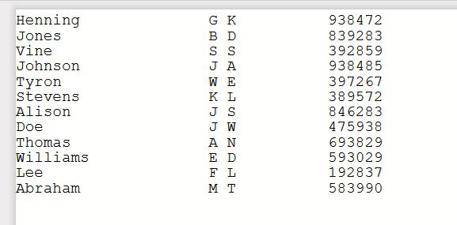
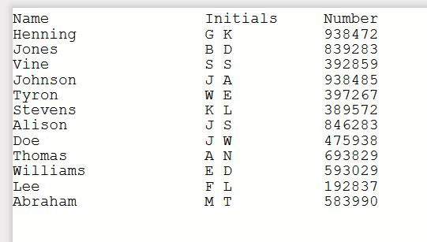
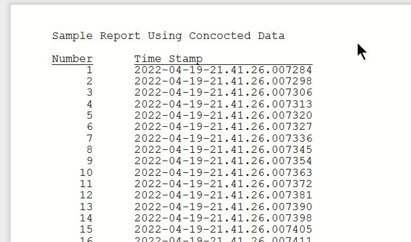
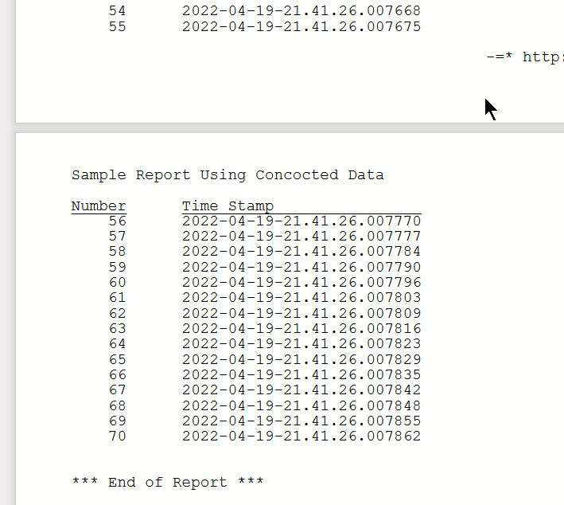

# Printing Techniques in RPG/**FREE
##  Printing without O-Specs or Externally Defined Printer Files
IBM has made just about everything in free format RPG truly free format. Except O-specs. Instead of adding free format support for O-specs, IBM expects you to use a separately externally defined printer file. This can can do everything O-specs can, but is an extra object. 

But you can easily print without needing an externally defined printer file. Following is an explanation and two demonstration programs.

It turns out to be easy in free form RPG, writing from a data structure, with code like this:
```
    dcl-ds line len(132) end-ds;
    write QPRINT line;
```
The easiest way to populate the date structure is to create "columns" of data. Something like this:
```
**free
ctl-opt option(*srcstmt) actgrp(*new) main(Prt);
dcl-f   QCUSTCDT Disk extfile('QIWS/QCUSTCDT');
dcl-f   QPRINT printer(132);
dcl-proc Prt;
    dcl-ds line len(132) inz qualified;
        custname    char(20);
        *n          char(1);
        custinit    char(10);
        *n          char(3);
        cusnum      char(6);
    end-ds;
    read QCUSTCDT;
    dow (not %eof(QCUSTCDT));
        line.cusnum = %char(CUSNUM);
        line.custname = LSTNAM;
        line.custinit = INIT;
        write QPRINT line;
        read QCUSTCDT;
    enddo;
    return;
end-proc;
```
If you run this, you get a nicely spaced report from file QIWS/QCUSTCDT data:


Let me express my thanks to **Cletus the Codeslinger** for the origin of this technique. [He wrote about this way back in 2004.](https://www.itjungle.com/2004/04/14/fhg041404-story02/)

Once you've defined the columns, heading are easy. Add code like this:
```
    dcl-ds head likeds(line);
    head.custname = 'Name';
    head.custinit = 'Initials';
    head.cusnum = 'Number';
    write QPRINT head;
```
Run it, and voila, column headings:



To handle page overflow, you use the OFLIND on the printer file:
```
dcl-f   QPRINT printer(132) oflind(*in99);
```
To skip to a new page or other wise control spacing, there are two options:
1. Use a PRTCTL data structure.
```
    dcl-f   QPRINT printer(132) oflind(*in99) prtctl(pCtl);
    dcl-ds  pCtl len(15) qualified inz;
    sp_b4    char(3);   // Space before
    sp_aft   char(3);   // Space after
    sk_b4    char(3);   // Skip to line num before
    sk_aft   char(3);   // Skip to line num after
    linenum  char(3);
```
You can find IBM [PRTCTL documentation here.](https://www.ibm.com/docs/en/i/7.4?topic=structcompat-extended-length-prtctl-data-structure)

2. Use First Character Forms Conrol (FCFC).
    In FCFC, the first character of the print line controls spacing and skipping. (This [Wiki article gives a decent overview of FCFC.](https://en.wikipedia.org/wiki/ASA_carriage_control_characters) There's an [IBM document here.](https://www.ibm.com/support/pages/list-fcfc-controls-and-their-meanings))
   ```
    FILE(MYPRT) CTLCHAR(*FCFC) CHLVAL((1 (3)))
    dcl-c TOP '1';       // Skip to top of page & print
    dcl-c S1  ' ';       // Space 1 line & print
    dcl-c S2  '0';       // Space 2 lines & print
    dcl-c S3  '-';       // Space 3 lines & print
    dcl-c S0  '+';       // Space 0, overprint
    ```
I chose to use FCFC, though in his article Cletus used a PRTCTL data structure.

I think that FCFC is quicker to code for simple reports, but PRTCTL data structure gives more control over skipping and spacing before and after printing.

For your perusal, I have provided demo code that produces the same report written both ways and produces a report like this:



### DEMOFCFC.RPGLE
Demo program to produce a report using First Character Form Control (FCFC)

### DEMOPRTCTL.RPGLE
Demo program to produce a report using a PRTCTL data structure.
