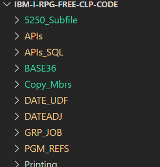
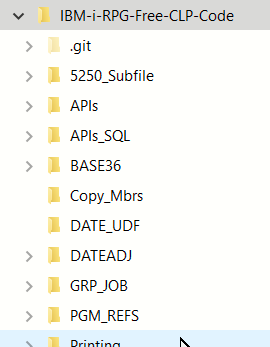

# RPGLE free format, SQL & CLP Code for the IBM i

**This repository contains *working* example code, using RPGLE free-format, enbedded SQL and CLP for the IBM i. All RPG code here is totally free form.**.

**Each folder has its own ReadMe with additional infomation/documentation.**

My intent is to provide real programs that help you learn and/or improve your current understanding. Explore and adapt the code to your needs. Some of the code may be of use "as is" but no guarantee is provided.

Feel free to provide comments and feedback as issues.

# Source Control Philosophy 

This code in this repository is based on having source in the file system (IFS) rather than the traditional approach of members in a PF-SRC file.

For these personal projects I use the free IBM i [PUB400.COM](https://pub400.com/). 

I edit and compile using [VS Code](https://code.visualstudio.com/) with the ["Code for IBM i"](https://codefori.github.io/docs/#/) extension. My source is/was in PF-SRC members and for backup I created a SAVF file of my PF-SRC files and downloaded it to my PC. But  I didn't do it regularly.

Now that ["Code for IBM i"](https://codefori.github.io/docs/#/) supports local development on a PC and will push code to the IFS, I am using Github as a permanent repository. Doing editing on my PC and pushing changes to Github and the IFS is easier than creating a save file and downloading it.

This means that on the IBM i, code is in directories in the IFS instead of being in PF-SRC file members.

This is my setup:

 - Github contains my personal "production" source. 
 - My PC has Git installed and the PC files are where I make changes. 
 - I deploy to the IFS to compile with ["Code for IBM i"](https://codefori.github.io/docs/#/).
 
My PC has a directory structure like this:

| Directory shown in VS CODE                   |Directory shown in File Explorer                       |
|----------------------------------------|---------------------------------------|
|       |    |

The IFS directory after deployment looks like this:

 
 
The primary difference from moving away from PF-SRC file members is that COPY and INCLUDE statements must now reference an IFS file. I do not want to hard code directory names so I am using relative addressing, such as

 ``/INCLUDE ../Copy_Mbrs/SRV_MSG_P.RPGLE``. 

## Copy_Mbrs

Code to be copied into other programs.

## Service_Pgms

Utility support routines that are called from other code.

## SQL_SKELETON

Batch program with SQL embedded in RPGLE. Includes error checking and handling.  There are two versions, one in completely free format and one not free with the D-Specs in fixed format.

## 5250 Subfile

Many shops are still using 5250 "green screen" applications and these need to be maintained and/or extended. This is a fully functional modernized 5250 "green screen" Customer Master maintenance and prompting application, with full screen and window displays, modular code, service programs, message files and a sample database.

## BASE36

A service program to add 1 to an alpha-numeric string of any length.

## DATE_UDF

SQL User Defined Functions to convert legacy dates to true dates.  Written in RPG.

## RCDLCKDSP

A standardized way to handle locked records in an interactive program, and display information about who is holding the lock.  For programs that use native IO.

## APIs

Commands, with CLP and RPG programs, calling IBM i APis.

## APIs_SQL

Commands, CLLE, SQLRPGLE using SQL access to APIs.
## PGM_REFS

SQL Procedure to find Program Usage recursively using DSPPGMREF

## Printing  

Technique for easy printing in RPG/**FREE without O-Specs or Externally Defined Printer Files

## PRT_CL

The PRTLN command to print a line from a CL program, including page control and headings

## GRP_JOB

Sets up group jobs suitable for an IBM i developer.

## USPS_Address

SQL QSYS2.HTTP_GET call to the US Post Office webtools API AddressValidateRequest.
RPG service program to call the API and parse the returned XML.

## Utils

Developer Utilities.

    QRY - Qry (List) Contents of a file
    
    RC - Display File Record count

